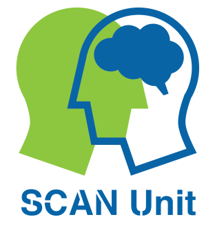
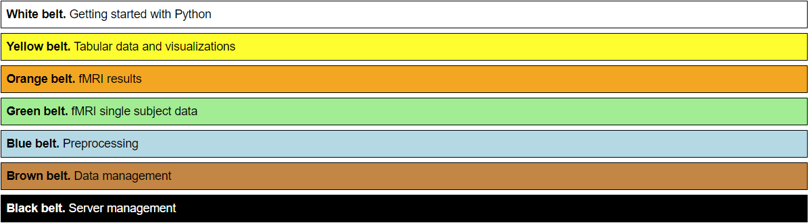

# SCAN-Unit Data Science Dojo

## Progression

The SCAN-Unit Data Science Dojo is new way of training cognitive neuroscientists to quickly learn to do something useful with neuroimaging data.

## The traditional approach

The traditional approach to learning data analysis typically follows the sequence of an fMRI study. This used to work in the good old the days when sample sizes were small and processing options were limited.

1. *Data curation.* You get a 100GB+ of raw data that you have to sort, check, and convert.
2. *Preprocessing.* Massive data processing that needs lots of know how about scripting, data processing efficiency (e.g., parallel computing, file I/O bottlenecks, data types) and fMRI methodology (e.g., is it state of the art to use slice-timing correction? T1-based normalization?).
3. *First level analysis.* Still complex, you have to parse logfiles (i.e., (semi-)structured text analyses), create proper design matrices, and get the timing right.
4. *Second level analysis.* As soon as you have the single-subject results, second level analyses are much simpler and faster to compute.
5. *Visualization.* There are many interesting ways to visualize and make sense of your data with python. It is a pitty that you would only learn about them at this point.
6. *Data extraction.* Here you reduce your dataset to a table or time series (e.g., Results, VOI timeseries) based on your research questions and hypotheses. You want to explore several things here (e.g., different masks) but won't change your previous analysis steps. 
7. *Statistical inference.* Based on a essentialized dataset you calculate the results of your study (e.g., t-test between groups)
8. *Correlations with Questionnaires.* Maybe you need to process questionnaire data as well - have you actually looked at all of them? This is something a junior colleague could actually do if only they knew the right way to do it.
9. *Figure and table creation.* Finally, you see the results of your work, something you can be proud of.
10. *Coding.* If you managed it till here you definitely showed that you are very hard working and not stupid. However, you realize that things would have been way easier if you knew how to code properly. (Nobody has ever told me the opposite.) 

## Challenges
- Large datasets require good infrastructure that you might not have access to in the beginning
- High CPU and I/O demands require good computing knowledge 
- Long time needed for first results and figure: frustrating low learning curve, waste of resources, people are not able to finish their projects 
- Lots of unnecessary redundancy: e.g., senior researcher needs to redo analysis)
- Many high-level skills are needed at beginning 
- There are no cooking recipes in science because of rapid changes in technologies and data quality
- No shortcuts when there is complexity

## Solutions
- Reduce the amount of data
- Reduce the amount of hard to run scripts in the beginning
- Work towards your first results quickly
- Leave the hard things to the more experienced colleagues (you cannot get it right for them, anyway)
- Learn the low-level skills first before you can take up the challenges of the hard problems
- Learn more general things first, which can also be applied in different contexts (e.g., different fields of science, industry), before you try to reproduce complicated and very specialized pipelines
- You need to understand things and you cannot understand complex things before you understand the simple things

## Typical scenarios for junior colleagues
- Analyze a questionnaire and correlate them to your fMRI results
- Create a nice figure for your paper or their student conference poster
- Do some additional data analyses on already existing data set (e.g., combining data from several studies)
- Writing an abstract or master thesis
- Teach them transferable skills they can use in the future

## Principles
- Improving communication between supervisor and student by rapid prototyping 
- Coding is learning by doing: problem solving, find the bug, divide and conquer
- Peer training: learning something together is easier. This only works if what you want to learn is somewhat related
- More independence: you don't want them to waste your time with basic questions / they don't ask you because they think their questions are too basic.
